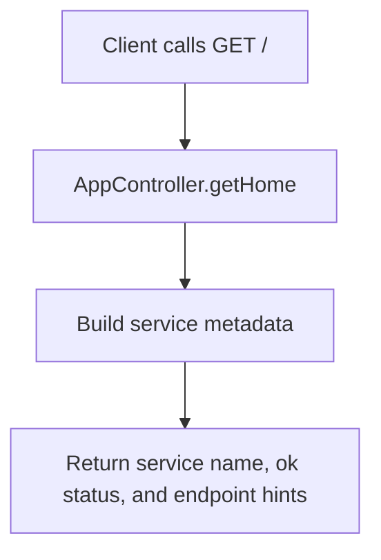
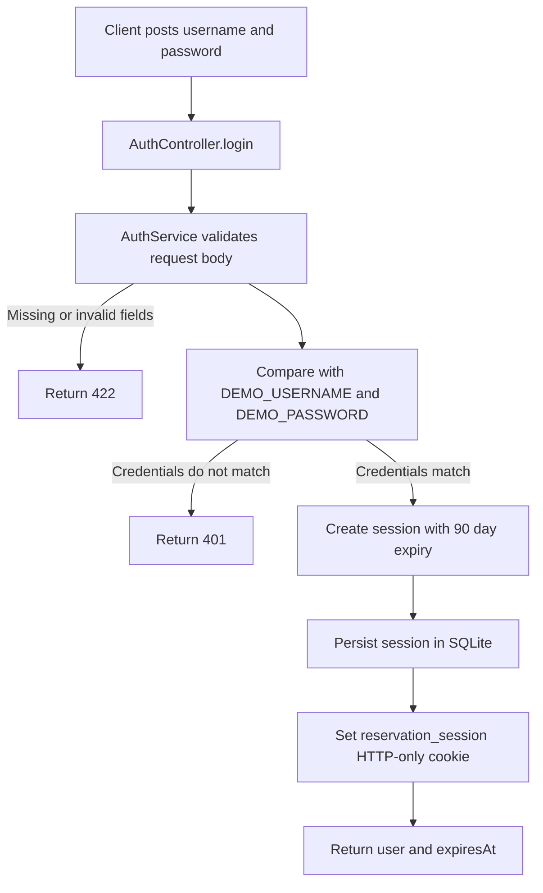
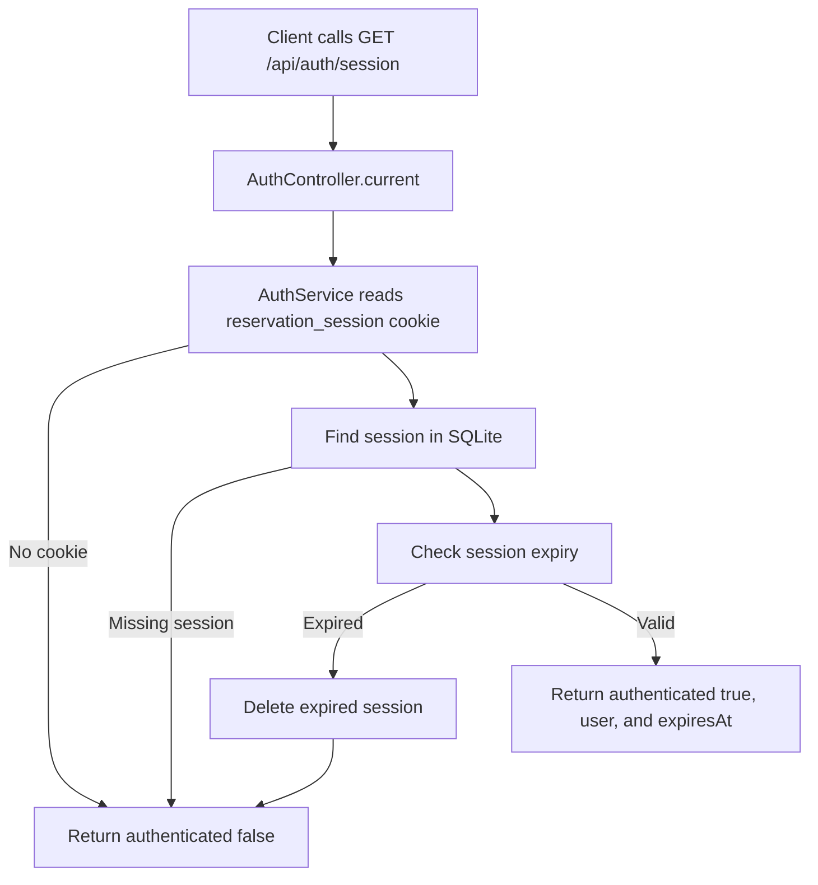
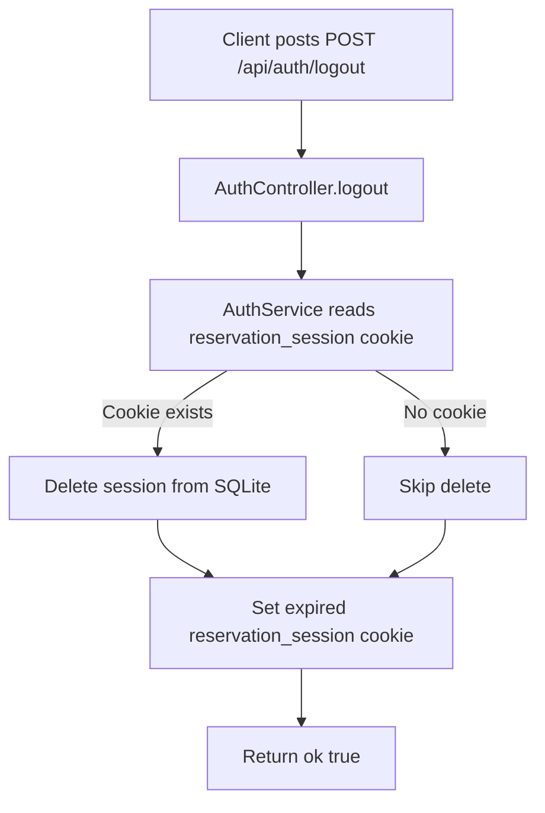
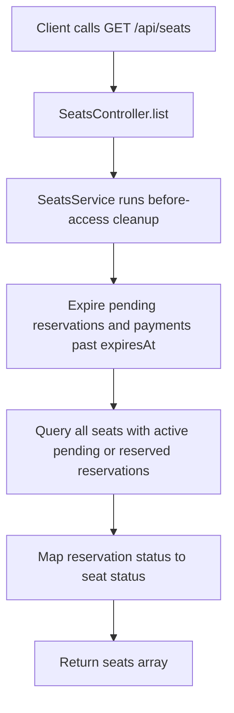
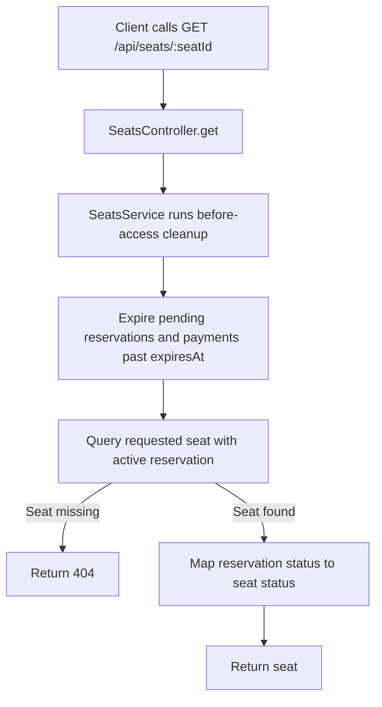
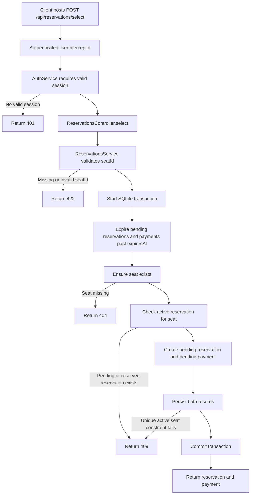
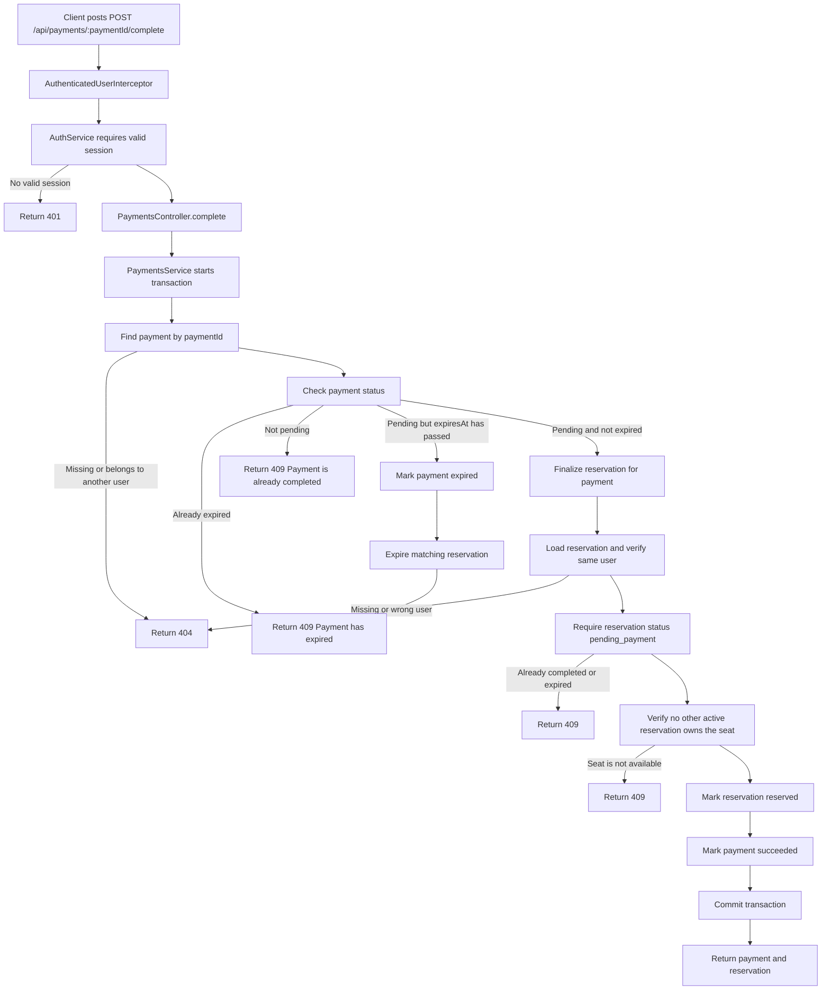
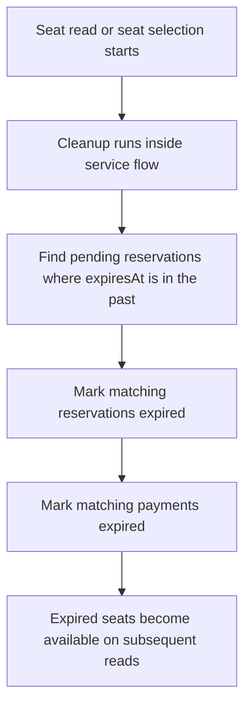

# Seat Reservation Service

A small NestJS seat reservation platform. It exposes JSON APIs for service metadata, demo login, seat listing, seat selection, mock payment completion, and final reservation.

## Setup

```bash
npm install
npm run start:dev
```

The app listens on `PORT` or `3000` by default. It is API-only; use HTTP clients such as `curl`, Postman, or automated tests to call the endpoints.

## Environment

| Variable | Default | Purpose |
| --- | --- | --- |
| `PORT` | `3000` | HTTP port. |
| `DEMO_USERNAME` | `demo@example.com` | Demo login username. |
| `DEMO_PASSWORD` | `password` | Demo login password. |
| `RESERVATION_DB_PATH` | `.data/reservation.sqlite` | SQLite database file path outside tests. |

Runtime state is stored in SQLite. The app creates the schema and seeds the three demo seats idempotently on startup. Under Jest (`NODE_ENV=test`), each app or service instance uses a fresh in-memory SQLite database (`:memory:`), so unit and e2e tests do not share state or write local database files.

Sessions are stored in SQLite and returned as a `reservation_session` HTTP-only cookie with `SameSite=Lax`, `Path=/`, and a 90 day `Max-Age`.

## API

- `GET /` returns JSON service metadata and available endpoint hints.
- `GET /api/seats` returns exactly 3 seats with `available`, `status`, and optional `reservationId`.
- `GET /api/seats/:seatId` returns one seat with `available`, `status`, and optional `reservationId`.
- `POST /api/auth/login` with `{ "username": "...", "password": "..." }` creates a session cookie.
- `GET /api/auth/session` returns the current authenticated user or `{ "authenticated": false }`.
- `POST /api/auth/logout` clears the session cookie.
- `POST /api/reservations/select` with `{ "seatId": "seat-1" }` requires auth, holds the seat, creates a pending reservation, and creates a pending payment.
- `POST /api/payments/:paymentId/complete` requires auth, marks the payment successful, and reserves the seat.

## Feature Flow Diagrams

The diagrams use Mermaid syntax, which renders in GitHub and many Markdown viewers.

### Service Metadata



### Demo Login



### Read Current Session



### Logout



### List Seats



### Get One Seat



### Select Seat



### Complete Payment



### Lazy Expiration Cleanup



## Assumptions And Trade-Offs

- SQLite is used for local durable runtime state without adding an npm database dependency. The default `.data/` directory is ignored by git.
- A pending reservation makes the seat unavailable immediately. This prevents double reservation while mock payment is incomplete.
- Pending reservations and payments expire after 1 hour. Expired pending reservations release their seat lazily during seat reads and new seat-selection attempts.
- Authentication is demo credential based and should be replaced with a real identity provider before production use.
- Controllers delegate business rules to services. Feature modules are split by auth, seats, reservations, payments, and shared cookie helpers so storage and workflow logic can be extended independently.
- DTO validation is explicit and local because no validation dependency is installed.

## Failure Cases

- Unauthenticated selection and payment completion return `401`.
- Invalid credentials return `401`.
- Missing or non-string `seatId` returns `422`.
- Unknown seats, payments, or reservations return `404`.
- Selecting a pending or reserved seat returns `409`.
- Completing an already completed payment returns `409`.
- Completing another user's payment is hidden as `404`.

## Operational Concerns

- The local SQLite database is suitable for single-process development and assessment runtime. Use a production database before scaling horizontally across multiple Node processes.
- Session secrets are not needed for the current random opaque session IDs, but a persistent session store should be used for production.
- Seat hold creation and payment completion use SQLite transactions. Active reservations are protected by a partial unique index on pending and reserved reservations per seat.
- Observability is currently limited to Nest defaults. Add structured logs and metrics around login attempts, seat selection conflicts, and payment completion failures.

## Extension Paths

- Replace local SQLite with repository interfaces backed by Postgres or another transactional database.
- Add background cleanup for old expired reservations and payments if local database files are kept long term.
- Add real users, authorization boundaries, and password hashing or SSO.
- Add real payment provider integration behind the existing payment service boundary.
- Add admin APIs for seat inventory management.

## Checks

```bash
npm test
npm run test:e2e
npm run lint
npm run build
```
