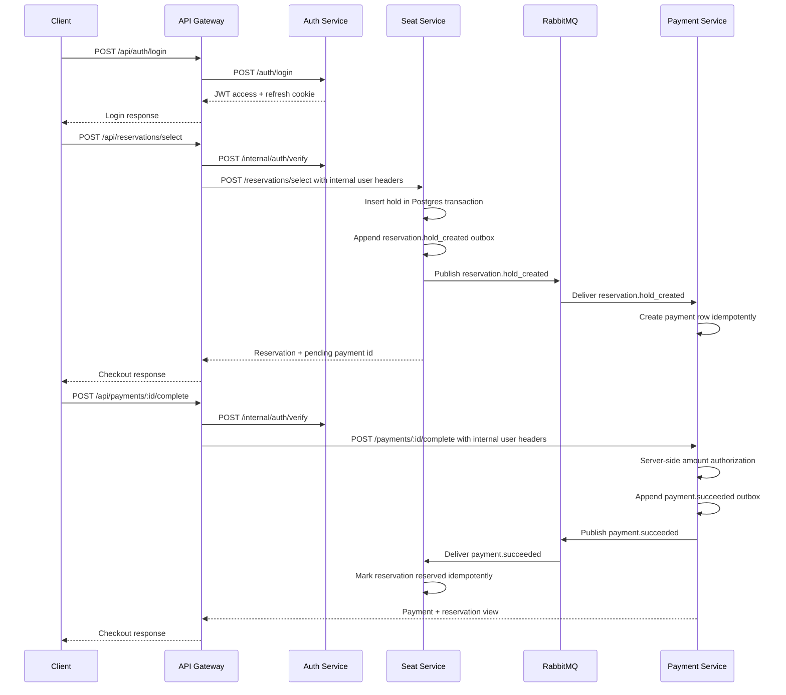

# Reservation Backend

NestJS microservices backend for the seat reservation flow. The browser still talks to one public API gateway on port `3000`, while auth, seat-reservation, and payment run as independently deployable services behind it.

## Layout

```text
backend/
  apps/
    api-gateway/       Public `/api/*` contract and auth propagation
    auth-service/      JWT access tokens, refresh-token rotation, users
    seat-service/      Seat reads, atomic holds, hold expiry, seat updates
    payment-service/   Mock Stripe-style payment boundary and webhooks
  packages/
    contracts/         Shared event and DTO contracts
    core/              Config, logging, Postgres, RabbitMQ, JWT, cookies
  infra/
    docker-compose.yml
    nginx/nginx.conf
    postgres/migrations/001_init.sql
    postgres/postgresql.conf
```

## Services

| Service           |   Port | Responsibility                                                                                                                                                      |
| ----------------- | -----: | ------------------------------------------------------------------------------------------------------------------------------------------------------------------- |
| `api-gateway`     | `3000` | Preserves `/api/auth/*`, `/api/seats`, `/api/reservations/select`, and `/api/payments/:id/complete` for the frontend.                                               |
| `auth-service`    | `3001` | Owns `auth.*` Postgres tables, Argon2id passwords, JWT access tokens, opaque hashed refresh tokens, rotation, reuse detection, logout invalidation, and audit logs. |
| `seat-service`    | `3002` | Owns `seat.*` tables, public seat reads, atomic hold creation, one active hold per seat/user, batch expiry sweeper, and reservation state transitions.              |
| `payment-service` | `3003` | Owns `payment.*` tables, server-side amount records, mock PSP boundary, signed webhook endpoint, webhook idempotency, and payment outcome events.                   |

RabbitMQ is used for service-to-service domain events. The gateway is the only synchronous integration point for client requests.

## Local Runtime

Copy `.env.example` to `.env` and replace the three required secrets. Then run:

```bash
docker compose -f infra/docker-compose.yml --env-file .env up --build
```

The gateway listens on `http://localhost:3000`. Nginx with route-specific rate limiting listens on `http://localhost:8080`.

RabbitMQ management UI is available on `http://localhost:15672`.

## API Contract

Existing frontend routes are preserved:

- `POST /api/auth/login` with `{ "username": "...", "password": "..." }`
- `POST /api/auth/refresh`
- `GET /api/auth/session`
- `POST /api/auth/logout`
- `GET /api/seats`
- `GET /api/seats/:seatId`
- `GET /api/seats/stream`
- `POST /api/reservations/select` with `{ "seatId": "seat-1" }`
- `POST /api/payments/:paymentId/complete`
- `POST /api/payments/webhook`

`/api/auth/login` returns the user and access-token expiry, sets an httpOnly access cookie, and sets an httpOnly `SameSite=Strict` refresh cookie scoped to `/api/auth`.

## Event Flow



## Postgres

The runtime uses Postgres only. Migrations are versioned SQL files in `infra/postgres/migrations`. The initial migration creates separate schemas for `auth`, `seat`, `payment`, and `eventing`.

Hot-path constraints and indexes include:

- `reservations_one_active_per_seat` partial unique index for `pending_payment` and `reserved`.
- `reservations_one_active_hold_per_user` partial unique index for `pending_payment`.
- `reservations_pending_expiry_idx` and `payments_pending_expiry_idx` for expiry sweeps.
- `webhook_events.event_id` primary key for webhook idempotency.
- `eventing.inbox` primary key on `(event_id, consumer)` for idempotent consumers.

The Postgres config enables slow query logging, lock-wait logging, and a one-second deadlock timeout.

## Checks

```bash
npm run build
npm test
npm run test:e2e
npm run lint
```

`test:e2e` is reserved for Docker-backed service tests. Unit tests cover pure JWT, HMAC webhook signature, and rate-limit behavior without requiring infrastructure.
